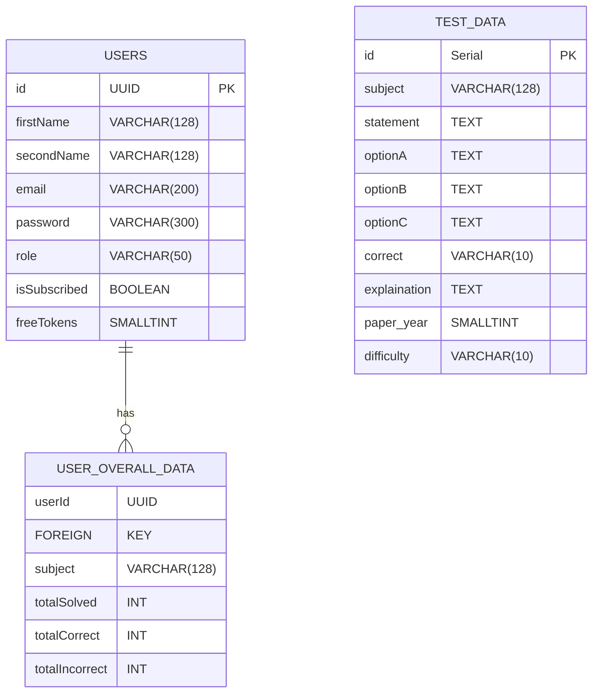

# LMS Database Schema

```mermaid

erDiagram

USERS {
    id UUID PK
    firstName VARCHAR(128)
    secondName VARCHAR(128)
    email VARCHAR(200)
    password VARCHAR(300)
    role VARCHAR(50)
    isSubscribed BOOLEAN
    freeTokens SMALLTINT
}

TEST_DATA {
    id Serial PK
    subject VARCHAR(128)
    statement TEXT
    optionA TEXT
    optionB TEXT
    optionC TEXT
    correct VARCHAR(10)
    explaination TEXT
    paper_year SMALLTINT
    difficulty VARCHAR(10)
}

USER_OVERALL_DATA {
    userId UUID FOREIGN KEY
    subject VARCHAR(128)
    totalSolved INT
    totalCorrect INT
    totalIncorrect INT
}

USERS || -- o{ USER_OVERALL_DATA : has

```
